<div align="center">

# 👻 Ghostarr

**Automated newsletter generator for your media server**

[](https://github.com/sharkhunterr/ghostarr/releases)
[](https://hub.docker.com/r/sharkhunterr/ghostarr)
[](https://hub.docker.com/r/sharkhunterr/ghostarr)
[](LICENSE)

[](https://python.org)
[](https://fastapi.tiangolo.com)
[](https://reactjs.org)
[](https://typescriptlang.org)
[](#-multi-language-support)


**[Quick Start](#-quick-start)** •
**[Features](#-features)** •
**[Docker Hub](https://hub.docker.com/r/sharkhunterr/ghostarr)** •
**[Screenshots](#-screenshots)**

</div>

---

## 🚀 What is Ghostarr?

Ghostarr automatically collects statistics and content from your media server services (Tautulli, Komga, Audiobookshelf, ROMM, Tunarr) and generates beautiful, responsive newsletters published to **Ghost CMS**. Keep your users informed about what's trending, new additions, and viewing statistics - all automated!

**Perfect for:**
- 🏠 Homelab owners sharing media with family & friends
- 📊 Media server admins wanting automated reports
- 📧 Ghost blog owners with media content
- 🤖 Anyone who wants set-it-and-forget-it newsletters

> [!WARNING]
> **Vibe Coded Project** - This application was built **100% using AI-assisted development** with [Claude Code](https://claude.ai/code).

---

## ✨ Features

<table>
<tr>
<td width="33%" valign="top">

### 🎬 Multi-Source Integration
**7 homelab services**
- **Tautulli** - Plex statistics
- **Ghost** - Newsletter publishing
- **TMDB** - Metadata enrichment
- **ROMM** - Game library
- **Komga** - Comics & manga
- **Audiobookshelf** - Audiobooks
- **Tunarr** - TV programming

</td>
<td width="33%" valign="top">

### 📅 Smart Scheduling
**Fully automated**
- CRON-based scheduling
- Timezone support
- Manual generation
- Real-time progress
- Scheduled cleanup
- Retention policies

</td>
<td width="33%" valign="top">

### 📊 Rich Content
**Beautiful newsletters**
- Ranking evolution
- Play statistics
- New additions
- Custom templates
- Responsive design
- Preview before send

</td>
</tr>
</table>

### 🎨 Modern Web UI
- 🌐 **5 languages** (EN, FR, DE, ES, IT)
- 🌓 Light/Dark/Auto themes
- 📱 Fully responsive design
- 💾 Export/Import configuration
- 📈 Complete history tracking

### 📬 Flexible Publishing
- **Draft only** - Review before publishing
- **Site only** - Blog post without email
- **Email only** - Newsletter distribution
- **Site + Email** - Full publication

---

## 🏃 Quick Start

### Docker Compose (Recommended)

```yaml
services:
  ghostarr:
    image: sharkhunterr/ghostarr:latest
    container_name: ghostarr
    ports:
      - "8080:8080"
    volumes:
      - ./config:/config
    environment:
      - TZ=Europe/Paris
      - APP_SECRET_KEY=your-secret-key-minimum-32-characters
    restart: unless-stopped
```

```bash
docker compose up -d
```

**Access**: http://localhost:8080

### Docker Run

```bash
docker run -d \
  --name ghostarr \
  -p 8080:8080 \
  -v $(pwd)/config:/config \
  -e TZ=Europe/Paris \
  -e APP_SECRET_KEY=your-secret-key-minimum-32-characters \
  sharkhunterr/ghostarr:latest
```

---

## 🔧 Configuration

### Environment Variables

| Variable | Default | Description |
|----------|---------|-------------|
| `APP_SECRET_KEY` | *required* | Encryption key (min 32 chars) |
| `TZ` | `UTC` | Container timezone |
| `APP_LOG_LEVEL` | `INFO` | Log level (DEBUG, INFO, WARNING, ERROR) |
| `PORT` | `8080` | Server port |

### First Launch

1. **Configure Services** - Add your Tautulli, Ghost, and other service credentials
2. **Test Connections** - Validate each service is reachable
3. **Create a Template** - Or use the default newsletter template
4. **Generate!** - Create your first newsletter manually or set up a schedule

---

## 🎯 Service Setup

### Tautulli
Fetches watch statistics, top movies, TV shows, and user activity from your Plex server.

1. Open Tautulli → Settings → Web Interface
2. Copy the **API Key**
3. Enter URL: `http://your-tautulli:8181`

### Ghost
Publishes newsletters to your Ghost blog.

1. Open Ghost Admin → Settings → Integrations
2. Add a **Custom Integration**
3. Copy the **Admin API Key**
4. Enter URL: `http://your-ghost:2368`

### TMDB (Optional)
Enriches movies and TV shows with metadata, ratings, and artwork.

1. Create account at [themoviedb.org](https://themoviedb.org)
2. Generate an API key in account settings
3. Only API key needed (no URL)

### Other Services
- **ROMM** - Game library (URL + username/password or API key)
- **Komga** - Comics library (URL + API key)
- **Audiobookshelf** - Audiobooks (URL + API token)
- **Tunarr** - TV channels (URL only, no auth required)

---

## 🏗️ Architecture

### Global Architecture


### Newsletter Generation Flow

```mermaid
sequenceDiagram
    participant User as 👤 User
    participant UI as 🖥️ Frontend
    participant API as ⚙️ Backend
    participant Services as 🔧 Services
    participant Ghost as 👻 Ghost

    User->>UI: Click "Generate"
    UI->>API: POST /newsletters/generate

    Note over API: Create History Entry
    API-->>UI: generation_id
    UI->>API: SSE /progress/{id}

    loop For Each Enabled Source
        API->>Services: Fetch Data
        Services-->>API: Movies, Shows, Games...
        API-->>UI: Progress Update
    end

    Note over API: Render Jinja2 Template
    API-->>UI: Progress: Rendering

    API->>Ghost: POST /ghost/api/admin/posts
    Ghost-->>API: Post Created

    Note over API: Update History
    API-->>UI: Progress: Complete
    UI-->>User: ✅ Newsletter Published!
```



### Scheduling Flow


---

## 📸 Screenshots

<details open>
<summary><b>📊 Dashboard & Generation</b></summary>

| Manual Generation | Schedule Management |
|-------------------|---------------------|
|  |  |

</details>

<details>
<summary><b>📝 History & Templates</b></summary>

| Generation History | Template Editor |
|--------------------|-----------------|
|  |  |

</details>

<details>
<summary><b>⚙️ Settings</b></summary>

| Services Config | General Settings |
|-----------------|------------------|
|  |  |

</details>

---

## 🌐 Multi-Language Support

Ghostarr is fully translated into **5 languages**:

🇬🇧 English • 🇫🇷 Français • 🇩🇪 Deutsch • 🇪🇸 Español • 🇮🇹 Italiano

Change language anytime from Settings → General.

---

## 🛠️ Technology Stack

| Layer | Technologies |
|-------|--------------|
| **Backend** | Python 3.11 • FastAPI • SQLAlchemy • Alembic • APScheduler |
| **Frontend** | React 18 • TypeScript • Tailwind CSS • Vite • Radix UI |
| **Data** | SQLite • Zustand • React Query |
| **DevOps** | Docker • GitLab CI |

---

## 📦 Data & Backup

### Volumes

| Path | Content |
|------|---------|
| `/config/data.db` | SQLite database (settings, history, schedules) |
| `/config/templates/` | Custom newsletter templates |

### Export/Import

Ghostarr supports full configuration export including:
- User preferences
- Retention settings
- Service configurations (with encrypted credentials)

Go to **Settings → General → Export/Import**

---

## 🤝 Contributing

Contributions welcome! Please:

1. Fork the repository
2. Create a feature branch
3. Run linting: `npm run lint`
4. Submit a pull request

---

## 🙏 Acknowledgments

**The Need**: Sharing a media server with family and friends is great, but keeping everyone informed about new content, viewing stats, and what's trending was tedious — manual updates, scattered information, no unified communication.

**The Solution**: Ghostarr was born to automate media server newsletters. Connect your services once, set up a schedule, and let your users discover what's new without you lifting a finger.

**The Approach**: As a young parent with limited time and no fullstack development experience (neither backend nor frontend), traditional coding wasn't an option. Built entirely through [Claude Code](https://claude.ai/code) using "vibe coding" — pure conversation, no manual coding required.

Special thanks to the homelab community and all contributors!

---

## 📄 License

MIT License - see [LICENSE](LICENSE) file for details.

---

<div align="center">

**Built with Claude Code 🤖 for the homelab community 🏠**

[](https://github.com/sharkhunterr/ghostarr)
[](https://hub.docker.com/r/sharkhunterr/ghostarr)

[⭐ Star on GitHub](https://github.com/sharkhunterr/ghostarr) • [🐛 Report Bug](https://github.com/sharkhunterr/ghostarr/issues) • [💡 Request Feature](https://github.com/sharkhunterr/ghostarr/issues)

</div>
