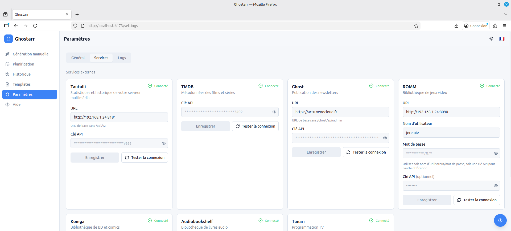
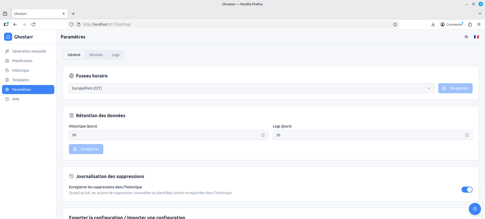

# ⚙️ Configuration Guide

This guide explains how to configure Ghostarr and connect your services.

## Service Configuration

All services are configured from **Settings → Services** in the web interface.

---

## Tautulli

Tautulli provides Plex viewing statistics, top movies, TV shows, and user activity.

### Setup

1. Open Tautulli → **Settings → Web Interface**
2. Copy the **API Key**
3. In Ghostarr, enter:
   - **URL**: `http://your-tautulli:8181`
   - **API Key**: Your Tautulli API key
4. Click **Test Connection**

### What it provides

- Top movies and TV shows by play count
- Most active users
- Recent plays and watch statistics
- Period-over-period comparisons

---

## Ghost CMS

Ghost is where your newsletters are published.

### Setup

1. Open Ghost Admin → **Settings → Integrations**
2. Click **Add Custom Integration**
3. Name it "Ghostarr"
4. Copy the **Admin API Key**
5. In Ghostarr, enter:
   - **URL**: `https://your-ghost-blog.com`
   - **Admin API Key**: Your Ghost admin API key
6. Click **Test Connection**

### Publication Modes

| Mode | Description |
|------|-------------|
| **Draft** | Creates a draft post (no publishing) |
| **Site only** | Publishes to blog without sending email |
| **Email only** | Sends newsletter without blog post |
| **Site + Email** | Full publication (blog + newsletter) |

---

## TMDB

TMDB enriches movies and TV shows with metadata, ratings, and poster artwork.

### Setup

1. Create an account at [themoviedb.org](https://www.themoviedb.org)
2. Go to **Settings → API**
3. Request an API key (free)
4. In Ghostarr, enter:
   - **API Key**: Your TMDB API key
5. Click **Test Connection**

> **Note**: TMDB only requires an API key, no URL needed.

---

## ROMM

ROMM is a video game library manager. Ghostarr can showcase your recent game additions.

### Setup

1. In ROMM, go to **Settings → API**
2. Generate an API key (or use username/password)
3. In Ghostarr, enter:
   - **URL**: `http://your-romm:8080`
   - **API Key** or **Username/Password**
4. Click **Test Connection**

---

## Komga

Komga manages comics and manga collections.

### Setup

1. In Komga, go to **Account Settings → API Keys**
2. Create a new API key
3. In Ghostarr, enter:
   - **URL**: `http://your-komga:25600`
   - **API Key**: Your Komga API key
4. Click **Test Connection**

---

## Audiobookshelf

Audiobookshelf is an audiobook library manager.

### Setup

1. In Audiobookshelf, go to **Settings → API**
2. Copy your API token
3. In Ghostarr, enter:
   - **URL**: `http://your-audiobookshelf:80`
   - **API Token**: Your Audiobookshelf token
4. Click **Test Connection**

---

## Tunarr

Tunarr provides TV programming guide information.

### Setup

1. Tunarr doesn't require authentication
2. In Ghostarr, enter:
   - **URL**: `http://your-tunarr:8000`
3. Click **Test Connection**

---

## General Settings

Access from **Settings → General**.

### Options

| Setting | Description |
|---------|-------------|
| **Language** | Interface language (EN, FR, DE, ES, IT) |
| **Theme** | Light, Dark, or System |
| **Timezone** | Used for schedules and display |

### Export/Import

- **Export**: Download your complete configuration as JSON
- **Import**: Restore configuration from a JSON file

> **Note**: Exported files include encrypted credentials.

---

## Retention Settings

Configure automatic cleanup of old data.

| Setting | Default | Description |
|---------|---------|-------------|
| History retention | 90 days | Delete history older than X days |
| Logs retention | 30 days | Delete logs older than X days |

---

## Next Steps

- [User Guide](user-guide.md) - Learn how to generate newsletters
- [Docker Guide](docker.md) - Advanced deployment options
