# 📖 User Guide

Complete guide to using Ghostarr for newsletter generation.

## Dashboard Overview

The dashboard is your main workspace for generating newsletters.

---

## Manual Generation

Generate a newsletter on-demand from the dashboard.

### Steps

1. Go to **Dashboard**
2. Select a **Template**
3. Configure **Content Sources**:
   - Enable/disable each source (Tautulli, ROMM, etc.)
   - Set the number of days to include
   - Set maximum items per source
4. Configure **Statistics** (if using Tautulli)
5. Configure **Maintenance Notice** (optional)
6. Set **Publication Mode**
7. Click **Generate Newsletter**

### Progress Tracking

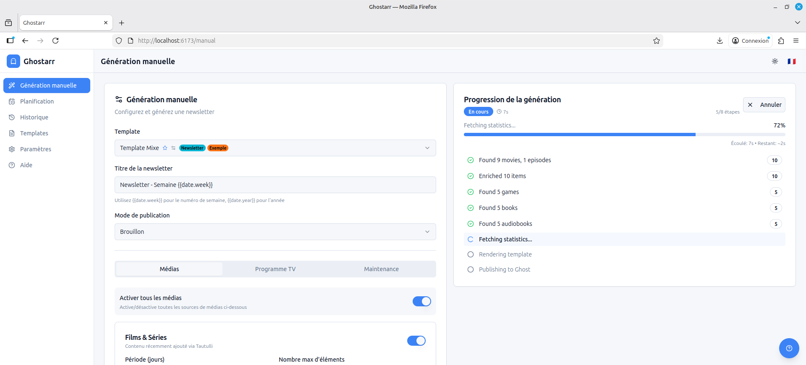

The progress modal shows:
- Current step being executed
- Time elapsed for each step
- Number of items collected
- Any errors encountered

### Completion

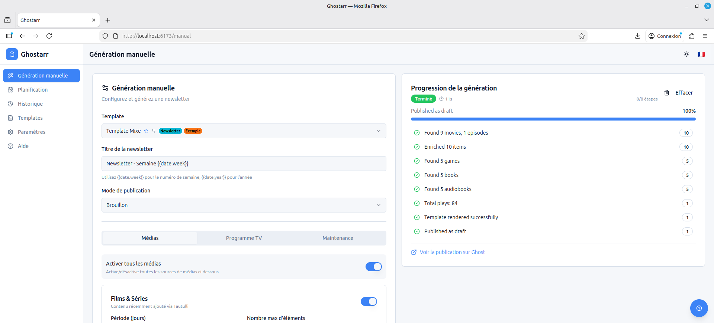

Once complete, you can:
- View the newsletter in Ghost
- Check the history for details
- Generate another newsletter

---

## Maintenance Notices

Inform your users about planned maintenance, incidents, or updates.

### Enabling Maintenance Notice

1. In the generation form, find the **Maintenance** section
2. Toggle **Enable maintenance notice**
3. Configure the notice:
   - **Type**: Choose the maintenance type
   - **Message**: Describe the maintenance
   - **Duration**: Estimated duration
   - **Start date/time**: When it starts (optional)

### Maintenance Types

| Type | Use Case |
|------|----------|
| **Scheduled maintenance** | Planned downtime for updates or maintenance |
| **Outage** | Unplanned service interruption |
| **Network issue** | Network-related problems |
| **Update** | New version or feature deployment |
| **Improvement** | Enhancements announcement |
| **Security** | Security patches or advisories |

### Maintenance-Only Newsletter

You can generate a newsletter with only a maintenance notice:
1. Disable all content sources (Tautulli, ROMM, etc.)
2. Enable maintenance notice
3. Configure the message
4. Generate the newsletter

> **Tip**: The "Skip if empty" option does not affect maintenance notices. A maintenance-only newsletter will always be generated.

---

## Scheduled Generation

Automate newsletter generation using schedules.

### Creating a Schedule

1. Go to **Dashboard → Schedules**
2. Click **New Schedule**
3. Configure:
   - **Name**: Descriptive name
   - **Type**: Generation or Cleanup
   - **CRON Expression**: When to run
   - **Timezone**: Schedule timezone
   - **Template**: Which template to use
   - **Configuration**: Content sources and options

### CRON Examples

| Expression | Description |
|------------|-------------|
| `0 9 * * 1` | Every Monday at 9:00 AM |
| `0 18 * * 5` | Every Friday at 6:00 PM |
| `0 10 1 * *` | First day of month at 10:00 AM |
| `0 8 * * *` | Every day at 8:00 AM |
| `0 0 * * 0` | Every Sunday at midnight |

### Schedule Types

**Generation Schedule**
- Creates and publishes newsletters automatically
- Uses the configured template and settings

**Cleanup Schedule**
- Deletes old history entries
- Optionally removes posts from Ghost
- Based on retention period

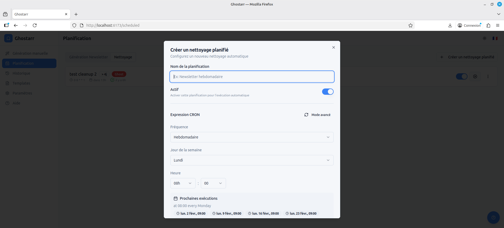

---

## Templates

Templates define how your newsletter looks.

### Default Template

Ghostarr includes a default template that works out of the box. It includes:
- Movie and TV show rankings
- New additions section
- Statistics comparison
- Responsive design

### Custom Templates

Templates use **Jinja2** templating language.

1. Go to **Templates**
2. Click **New Template**
3. Edit the HTML/Jinja2 code
4. Save and preview

### Template Preview

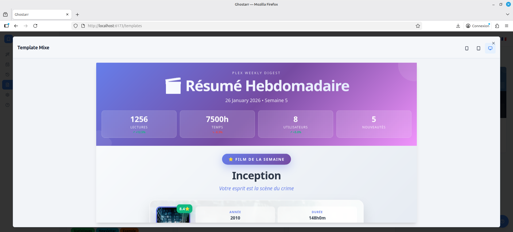

Preview shows how your newsletter will look with sample data.

### Template Labels

Organize templates with labels:

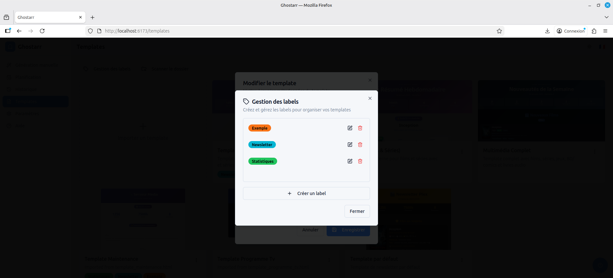

### Importing Templates

Import templates from the built-in template folder:

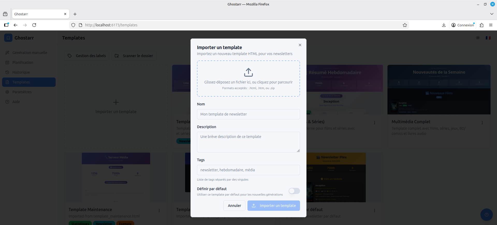

### Preset Configuration

Set default content configuration for a template:

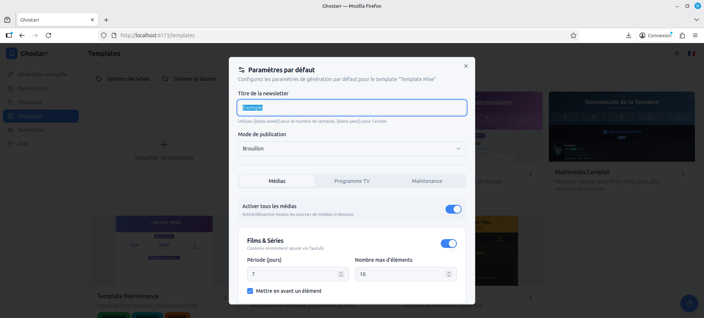

---

## History

Track all newsletter generations and deletions.

### View Details

Click on any history entry to see:
- Complete progress log
- Configuration used
- Ghost post link
- Error messages (if any)

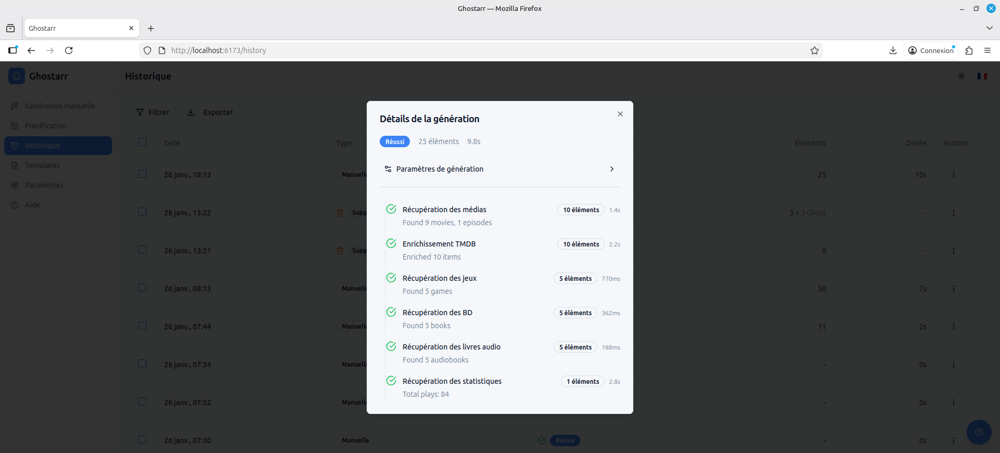

### Bulk Actions

- Select multiple entries
- Delete from history
- Delete from history and Ghost

---

## Settings

### Services

Configure your external services:

For each service:
1. Enter the URL and credentials
2. Click **Test Connection**
3. Save when all tests pass

### General

- **Language**: Choose interface language
- **Theme**: Light, Dark, or System
- **Timezone**: Default timezone for display
- **Export/Import**: Backup your configuration

### Logs

View application logs:

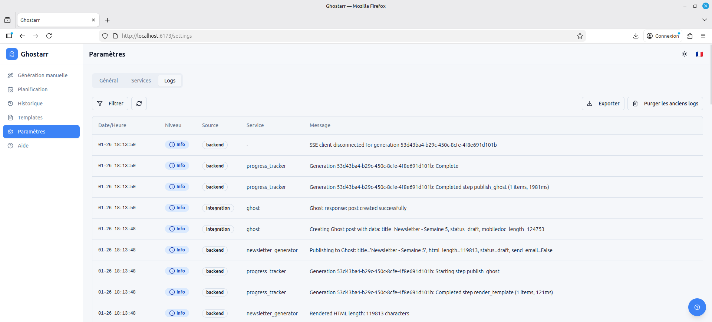

Filter by:
- Log level (Debug, Info, Warning, Error)
- Source (Backend, Frontend, Integration)
- Date range

---

## Notifications

Real-time notifications appear during generation:

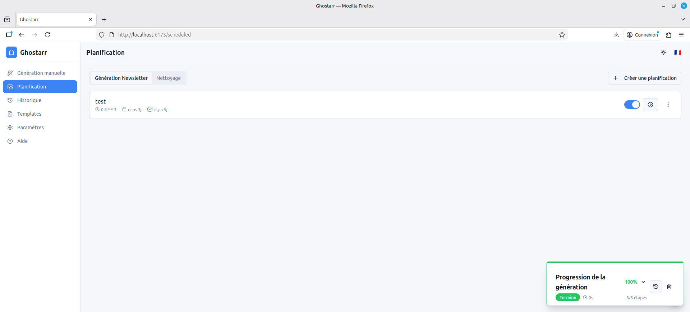

Click to expand details:

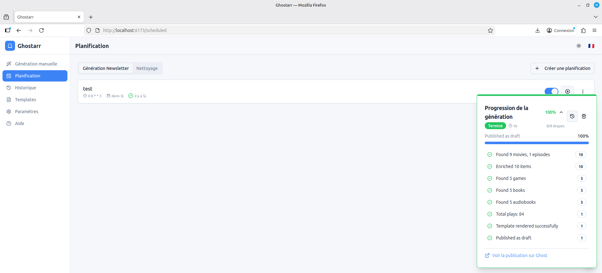

---

## Dark Mode

Ghostarr supports dark mode:

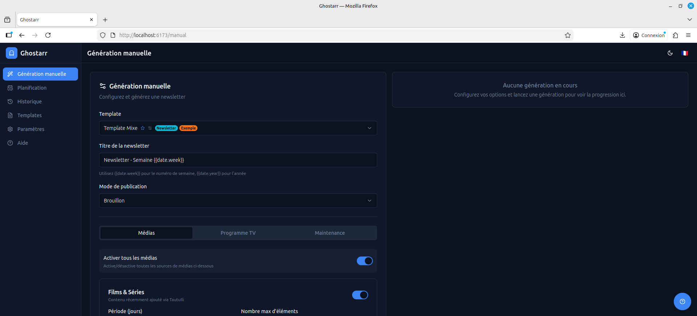

Change theme in **Settings → General → Theme**.

---

## Help

Access the help page for quick reference:

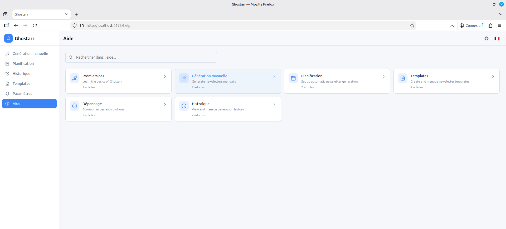

---

## Tips & Best Practices

### Newsletter Content

- **Start small**: Enable 1-2 sources first
- **Test with draft mode**: Review before publishing
- **Check preview**: Always preview before sending

### Scheduling

- **Avoid peak times**: Schedule during low-traffic hours
- **Use cleanup schedules**: Keep history manageable
- **Test manually first**: Ensure everything works before automating

### Templates

- **Keep it simple**: Ghost emails work best with simple HTML
- **Test across devices**: Preview on mobile and desktop
- **Use the default**: Customize the default template rather than starting from scratch

### Troubleshooting

- **Check logs**: Settings → Logs shows all errors
- **Test connections**: Verify all services are reachable
- **Review history**: Check error messages in history details

---

## Next Steps

- [Configuration Guide](configuration.md) - Service setup details
- [Docker Guide](docker.md) - Deployment options
- [GitHub Issues](https://github.com/sharkhunterr/ghostarr/issues) - Report problems
